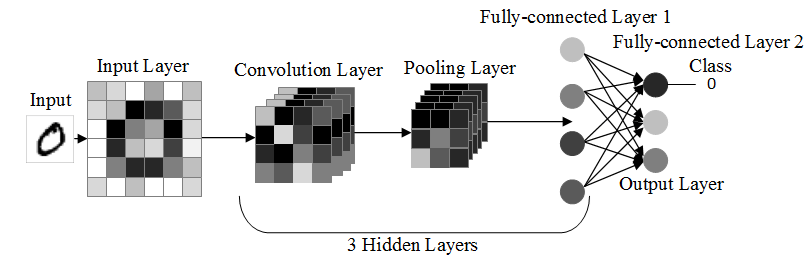
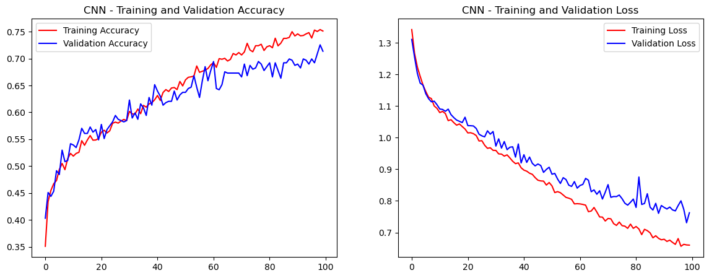
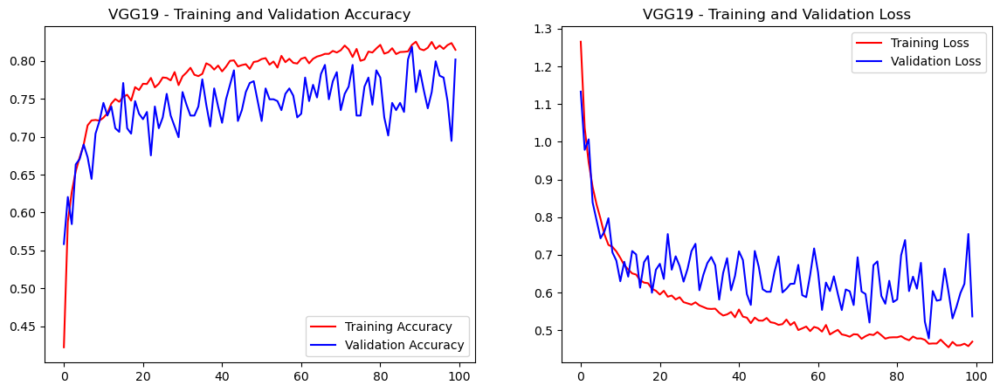
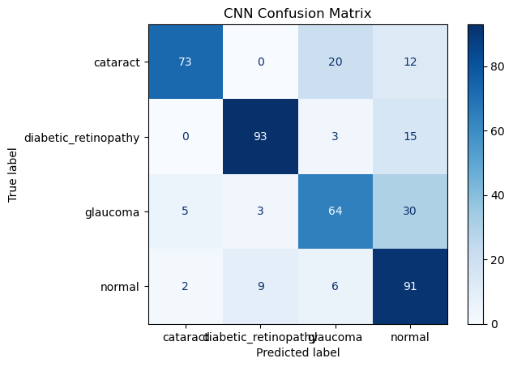
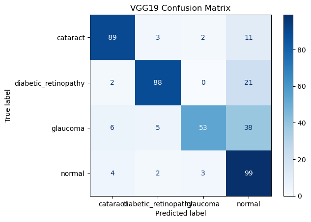

# Klasifikasi Penyakit Mata melalui Citra Retina menggunakan CNN (Convolutional Neural Network) dengan Model Arsitektur VGG-19 👁️

## 📖 Deskripsi Proyek
Proyek ini berfokus pada klasifikasi penyakit mata manusia melalui citra retina menggunakan Convolutional Neural Networks (CNN) dan dengan menggunakan arsitektur model VGG-19. Penyakit mata seperti *diabetic_retinopathy*, *glaucoma*, dan *cataract* merupakan risiko kesehatan yang serius, dan deteksi dini sangat penting untuk mencegah dampak buruk, termasuk kebutaan.

---
## 🎯 Tujuan
Tujuan proyek ini adalah memanfaatkan teknik pembelajaran mesin *(Machine Learning)* dan mendalam *(Deep Learning)* untuk mengembangkan sistem klasifikasi yang akurat dan efisien untuk penyakit mata, sehingga dapat menjadi alat bantu bagi tenaga medis dalam diagnosis dan perencanaan pengobatan.

---
## 🌕 Dataset
Dataset yang digunakan untuk pelatihan dan pengujian model diperoleh dari Kaggle. Dataset ini terdiri dari 4217 citra retina yang telah dikategorikan ke dalam beberapa jenis penyakit mata dengan pembagian sebanyak 1098 *diabetic_retinopathy*, 1007 *glaucoma*,  1038 *cataract* dan 1074 *normal* yang kemudian di pisah dengan ratio 80% data train, 10% data val, dan 10% data test, dan setelah itu melakukan proses augmentasi 1:4 terhadap data train. Anda dapat mengunduh dataset melalui tautan berikut: [Dataset Citra Retina dari Kaggle](https://www.kaggle.com/).

---
## 🚀 Instalasi
Ikuti langkah-langkah berikut untuk mengatur dan menjalankan aplikasi:

### Prasyarat
Pastikan Python sudah terinstal di sistem Anda. Disarankan menggunakan Python versi 3.11.4 atau lebih baru.

### Langkah Instalasi
1. Clone repositori:
   ```bash
   git clone <repository-link>
   cd <repository-folder>
   ```

2. Instal dependensi yang dibutuhkan:
   - Instal TensorFlow:
     ```bash
     pip install tensorflow
     ```
   - Instal dependensi lainnya menggunakan `pdm`:
     ```bash
     pdm add streamlit
     pdm add tensorflow
     ```

3. Masuk ke direktori aplikasi:
   ```bash
   cd src/code
   ```

4. Jalankan aplikasi menggunakan Streamlit:
   ```bash
   streamlit run app.py
   ```

---
## 🧠 Deskripsi Model
---
### CNN Model
Model Convolutional Neural Network (CNN) memiliki 3 hidden layers, fully-connected layers 1, dan fully-connected layers 2 memiliki struktur kompleks. Data input, seperti gambar, diproses melalui tiga hidden layers yang terdiri dari convolutional layers untuk mengekstrak fitur lokal (seperti tepi dan tekstur) dan pooling layers untuk mengurangi dimensi data. Hasilnya diteruskan ke fully-connected layer pertama yang meratakan data, diikuti oleh fully-connected layer kedua untuk menghasilkan representasi fitur lebih kompleks, yang akhirnya menghasilkan prediksi. Struktur ini memungkinkan model menangkap pola yang lebih mendalam, meskipun memerlukan komputasi lebih tinggi dan risiko overfitting jika dataset terbatas.



---
### Arsitektur Model VGG-19
VGG19 adalah salah satu arsitektur dari **Convolutional Neural Network (CNN)** yang terkenal karena kedalamannya yang mencapai 19 lapisan. Arsitektur ini terdiri dari 16 **Convolutional layers**, yang berperan penting dalam mengekstraksi fitur-fitur utama dari citra, seperti tepi, tekstur, dan pola bentuk yang lebih kompleks. Setiap lapisan konvolusi bekerja secara hierarkis, mulai dari fitur dasar di lapisan awal hingga fitur yang lebih kompleks di lapisan-lapisan berikutnya. Selain itu, VGG19 dilengkapi dengan 5 **Max pooling layers**, yang berfungsi untuk mereduksi dimensi data yang diproses, mengurangi kompleksitas komputasi, serta meningkatkan kemampuan model dalam melakukan generalisasi terhadap data baru. Proses ini juga membantu dalam mengurangi risiko overfitting, memungkinkan model untuk lebih adaptif terhadap variabilitas dalam data. Pada bagian akhir, model ini memiliki 3 **fully connected layers**, yang menghubungkan neuron-neuron dari lapisan-lapisan sebelumnya untuk menghasilkan keputusan klasifikasi yang akurat. Fully connected layers bertugas untuk menggabungkan informasi yang telah diproses di lapisan konvolusi dan pooling, sehingga menghasilkan prediksi akhir berdasarkan informasi yang terkandung dalam fitur citra. Karena kemampuannya dalam menangkap informasi secara mendalam dan hierarkis, VGG19 telah banyak diterapkan dalam berbagai aplikasi pengenalan citra, termasuk pengenalan wajah, klasifikasi objek, dan analisis citra medis, menjadikannya pilihan populer dalam tugas-tugas yang melibatkan data citra kompleks.


# Analisis Performa
----------
## Analisis Performa Model CNN 
Model Convolutional Neural Network (CNN) ini dirancang dengan tiga hidden layers yang terdiri dari convolutional layers untuk mengekstraksi fitur lokal, seperti tepi dan tekstur, serta pooling layers untuk mengurangi dimensi data dan meningkatkan efisiensi komputasi. Hasil ekstraksi fitur dari convolutional layers kemudian diteruskan ke dua fully-connected layers yang memungkinkan model untuk mempelajari representasi fitur yang lebih kompleks. Struktur ini memungkinkan model untuk menangkap pola yang lebih mendalam, yang sangat berguna untuk klasifikasi citra.

## Tantangan dan Risiko Overfitting
Meskipun demikian, model yang kompleks dengan banyak parameter ini dapat mengalami overfitting, terutama ketika dataset terbatas. Overfitting terjadi ketika model terlalu menyesuaikan diri dengan data pelatihan dan gagal menggeneralisasi dengan baik pada data uji. Oleh karena itu, penting untuk menggunakan teknik regulasi untuk mencegah overfitting.

## Waktu Pelatihan dan Komputasi
Model ini membutuhkan waktu pelatihan yang lebih lama dan memerlukan sumber daya komputasi yang lebih besar karena kompleksitasnya. Namun, dengan penerapan teknik regulasi seperti dropout, L2 regularization, dan early stopping, risiko overfitting dapat diminimalkan. Untuk meningkatkan performa, penggunaan teknik seperti data augmentation dan batch normalization dapat membantu memperkecil dimensi data yang tidak relevan dan mempercepat proses konvergensi selama pelatihan.

## Evaluasi Performa Model
Evaluasi performa model ini dapat dilakukan dengan mengukur berbagai metrik seperti:
- **Akurasi:** Untuk melihat seberapa banyak prediksi yang benar dibandingkan dengan jumlah total prediksi.
- **Precision, Recall, dan F1-score:** Memberikan gambaran yang lebih lengkap tentang kemampuan model dalam membuat prediksi yang benar dan menghindari kesalahan seperti false positives dan false negatives.
- **Confusion Matrix:** Untuk mengidentifikasi jenis kesalahan yang sering terjadi dalam prediksi model.

## Kesimpulan
Secara keseluruhan, meskipun model CNN dengan tiga hidden layers dan dua fully-connected layers memiliki potensi untuk menangkap pola yang lebih kompleks, pemantauan yang cermat terhadap metrik evaluasi dan penerapan teknik regulasi sangat diperlukan untuk mencapai performa yang optimal, terutama jika dataset terbatas. Dengan teknik-teknik ini, model dapat dioptimalkan untuk mencapai akurasi yang lebih baik tanpa mengalami overfitting.

---
# Analisis Performa Model VGG19
Model **VGG19** adalah salah satu arsitektur deep learning yang sangat populer dan efektif dalam menangani berbagai masalah pengenalan citra. Model ini memiliki kedalaman yang mencapai 19 lapisan, yang terdiri dari 16 **Convolutional Layers** dan 3 **Fully Connected Layers**. VGG19 terkenal karena kemampuannya dalam mengekstraksi fitur secara hierarkis, mulai dari fitur dasar pada lapisan awal hingga fitur yang lebih kompleks pada lapisan-lapisan berikutnya.

## Struktur Arsitektur
- **Convolutional Layers:** Model VGG19 dilengkapi dengan 16 lapisan konvolusi yang sangat penting untuk mengekstraksi fitur-fitur utama dari citra, seperti tepi, tekstur, dan pola bentuk yang lebih kompleks. Setiap lapisan konvolusi bekerja secara hierarkis, dengan lapisan awal mengidentifikasi fitur dasar dan lapisan berikutnya menangkap fitur yang lebih kompleks.
- **Max Pooling Layers:** Selain lapisan konvolusi, VGG19 juga memiliki 5 lapisan **max pooling** yang berfungsi untuk mereduksi dimensi data yang diproses. Proses ini tidak hanya mengurangi kompleksitas komputasi, tetapi juga meningkatkan kemampuan model dalam melakukan generalisasi terhadap data baru, serta membantu mengurangi risiko overfitting. Max pooling juga memungkinkan model untuk menangani variabilitas dalam data dengan lebih baik.
- **Fully Connected Layers:** Pada bagian akhir, VGG19 dilengkapi dengan 3 lapisan **fully connected** yang bertugas menghubungkan neuron-neuron dari lapisan-lapisan sebelumnya dan menghasilkan keputusan klasifikasi yang akurat. Lapisan fully connected menggabungkan informasi yang telah diproses di lapisan konvolusi dan pooling untuk menghasilkan prediksi akhir berdasarkan fitur-fitur citra yang telah dipelajari.

## Keunggulan dan Penerapan
Model VGG19 memiliki kemampuan yang sangat baik dalam menangkap informasi secara mendalam dan hierarkis, menjadikannya pilihan populer dalam berbagai aplikasi pengenalan citra. Beberapa aplikasi umum dari VGG19 antara lain:
- **Pengenalan Wajah:** Menggunakan model ini untuk mengenali wajah dalam citra.
- **Klasifikasi Objek:** Mampu mengenali berbagai objek dalam citra dan mengklasifikasikannya dengan akurasi tinggi.
- **Analisis Citra Medis:** Digunakan dalam analisis citra medis untuk mendeteksi dan mengklasifikasikan penyakit berdasarkan citra medis seperti CT scan atau MRI.

Karena strukturnya yang dalam dan mampu menangkap informasi secara bertahap, VGG19 sangat efektif untuk tugas-tugas yang melibatkan data citra yang kompleks dan beragam.

## Tantangan dan Komputasi
Meskipun VGG19 menawarkan performa yang luar biasa dalam pengenalan citra, model ini membutuhkan sumber daya komputasi yang besar. Kedalaman model dan jumlah parameter yang banyak menjadikan VGG19 cukup berat untuk dilatih, terutama pada dataset yang besar. Oleh karena itu, penting untuk memastikan bahwa sumber daya perangkat keras yang cukup tersedia, serta untuk menerapkan teknik-teknik regulasi untuk menghindari overfitting, seperti dropout atau L2 regularization.

## Kesimpulan
VGG19 adalah arsitektur deep learning yang sangat kuat untuk tugas pengenalan citra, berkat kedalamannya yang mencapai 19 lapisan dan kemampuan untuk mengekstraksi fitur secara hierarkis. Dengan kombinasi lapisan konvolusi, pooling, dan fully connected, model ini dapat menangkap pola-pola yang sangat kompleks dalam data citra. Meskipun demikian, karena kebutuhan komputasi yang tinggi, perhatian terhadap teknik regulasi dan optimasi sangat diperlukan untuk mendapatkan hasil yang optimal.


---

## 📊 Hasil dan Analisis
Hasil klasifikasi dirangkum dalam tabel berikut:

*CNN*
| **Class**   | **Precision** | **Recall** | **F1-Score** | **Support** |
|-------------|---------------|------------|--------------|-------------|
| **Cataract**| 0.91          | 0.70       | 0.79         |105          |
| **Diabetic**| 0.89          | 0.84       | 0.86         |111          |
| **Glaucoma**| 0.69          | 0.63       | 0.66         |102          |
| **Normal**  | 0.61          | 0.84       | 0.71         |108          |
|------------|--------------|-----------|-------------|------------|
| **Accuracy**|               |            | 0.75         |426          |
| **MacroAVG**| 0.78          | 0.75       | 0.75         |426          |
| **MicroAVG**| 0.78          | 0.75       | 0.76         |426          |
----
## Analisis
Berdasarkan hasil evaluasi model yang diberikan pada tabel di atas, kita dapat melihat metrik-metrik utama seperti Precision, Recall, dan F1-Score untuk masing-masing kelas yang terkait dengan diagnosis penyakit mata, yaitu **Cataract**, **Diabetic**, **Glaucoma**, dan **Normal**. 

- **Cataract** menunjukkan hasil Precision yang cukup tinggi (0.91), namun Recall-nya relatif lebih rendah (0.70), yang berarti meskipun model mampu mengidentifikasi sebagian besar prediksi yang benar untuk kelas ini, ada banyak kasus cataract yang tidak terdeteksi (false negatives). F1-Score untuk kelas ini adalah 0.79, yang menunjukkan keseimbangan antara Precision dan Recall.
  
- **Diabetic** memiliki Precision yang tinggi (0.89) dan Recall yang lebih baik lagi (0.84), dengan F1-Score mencapai 0.86. Hal ini menunjukkan bahwa model sangat efektif dalam mendeteksi kasus Diabetic, dengan sedikit kesalahan dalam prediksi baik itu false positives maupun false negatives.
  
- **Glaucoma** menunjukkan Precision yang lebih rendah (0.69) dan Recall yang juga rendah (0.63), yang berarti model kurang efektif dalam mendeteksi kasus Glaucoma. F1-Score untuk kelas ini adalah 0.66, yang menandakan adanya ketidakseimbangan antara Precision dan Recall, dan kemungkinan besar ini menjadi titik kelemahan dari model dalam mendeteksi Glaucoma secara akurat.
  
- **Normal** memiliki Precision yang terendah di antara semua kelas (0.61), meskipun Recall-nya cukup tinggi (0.84). Hal ini mengindikasikan bahwa meskipun banyak kasus **Normal** yang berhasil terdeteksi, ada banyak prediksi yang salah (false positives) untuk kelas ini, yang mengurangi akurasi keseluruhan pada kelas tersebut. F1-Score-nya adalah 0.71, menunjukkan adanya ketidakseimbangan antara deteksi dan kesalahan prediksi.

Secara keseluruhan, **Accuracy** model mencapai 0.75, yang berarti 75% dari semua prediksi yang dibuat oleh model adalah benar. Untuk **Macro Average**, Precision dan Recall masing-masing adalah 0.78 dan 0.75, sementara F1-Score-nya adalah 0.75, yang menunjukkan performa model yang cukup baik secara keseluruhan, meskipun ada ruang untuk perbaikan pada beberapa kelas. Sedangkan **Micro Average** menghasilkan nilai Precision 0.78, Recall 0.75, dan F1-Score 0.76, yang menunjukkan bahwa model memiliki performa yang stabil ketika memperhitungkan seluruh dataset secara keseluruhan.

Secara keseluruhan, model ini bekerja baik dalam beberapa kelas seperti Diabetic dan Cataract, namun masih perlu perbaikan dalam mendeteksi kelas Glaucoma dan mengurangi kesalahan pada kelas Normal, untuk mencapai keseimbangan yang lebih baik antara Precision dan Recall pada semua kelas.

----
*VGG19*
| **Class**   | **Precision** | **Recall** | **F1-Score** | **Support** |
|-------------|---------------|------------|--------------|-------------|
| **Cataract**| 0.88          | 0.85       | 0.86         |105          |
| **Diabetic**| 0.90          | 0.79       | 0.84         |111          |
| **Glaucoma**| 0.91          | 0.52       | 0.66         |102          |
| **Normal**  | 0.59          | 0.92       | 0.71         |108          |
|------------|--------------|-----------|-------------|------------|
| **Accuarcy**|               |            | 0.77         |426          |
| **MacroAVG**| 0.82          | 0.77       | 0.77         |426          |
| **MicroAVG**| 0.82          | 0.77       | 0.77         |426          |
---
## Analisis
Berdasarkan hasil evaluasi model pada tabel di atas, berikut adalah analisis metrik Precision, Recall, dan F1-Score untuk setiap kelas:

- **Cataract** memiliki Precision yang cukup tinggi (0.88) dan Recall yang juga baik (0.85), dengan F1-Score 0.86. Hal ini menunjukkan model mampu mendeteksi sebagian besar kasus cataract dengan akurat, meskipun masih ada beberapa kasus yang tidak terdeteksi (false negatives).
  
- **Diabetic** menunjukkan Precision yang sangat baik (0.90), namun Recall-nya lebih rendah (0.79), menghasilkan F1-Score 0.84. Meskipun model memiliki ketepatan tinggi dalam mengidentifikasi diabetes, ada sejumlah kasus yang terlewat dalam deteksi.
  
- **Glaucoma** memiliki Precision yang sangat baik (0.91), tetapi Recall-nya sangat rendah (0.52), dengan F1-Score 0.66. Hal ini menunjukkan bahwa meskipun model cukup akurat dalam mengidentifikasi prediksi positif untuk Glaucoma, banyak kasus Glaucoma yang tidak terdeteksi (false negatives), yang merupakan titik kelemahan signifikan pada model ini.
  
- **Normal** memiliki Precision yang rendah (0.59), meskipun Recall-nya tinggi (0.92), menghasilkan F1-Score 0.71. Ini menunjukkan bahwa model sangat baik dalam mendeteksi kondisi normal, namun sering kali menghasilkan prediksi positif palsu (false positives).

Secara keseluruhan, model ini memiliki **Accuracy** sebesar 0.77, yang berarti 77% dari prediksi model adalah benar. Untuk **Macro Average**, Precision adalah 0.82, Recall 0.77, dan F1-Score 0.77, yang menunjukkan kinerja model yang baik, meskipun ada ketidakseimbangan antara Precision dan Recall pada beberapa kelas. Sedangkan **Micro Average** menghasilkan nilai Precision 0.82, Recall 0.77, dan F1-Score 0.77, yang menggambarkan performa model yang konsisten ketika memperhitungkan seluruh dataset.

Secara keseluruhan, model ini bekerja dengan baik pada sebagian besar kelas, terutama pada Diabetic dan Glaucoma, meskipun deteksi Glaucoma dan klasifikasi Normal dapat diperbaiki lebih lanjut.

---


### Perbandingan Performa
Secara keseluruhan, perbandingan antara model CNN dan VGG19 menunjukkan bahwa keduanya memiliki keunggulan dan kelemahan masing-masing dalam menangani dataset ini. Model CNN, berdasarkan hasil pada Tabel 1, memiliki **Accuracy** 0.75, dengan nilai **Macro Average** Precision 0.78, Recall 0.75, dan F1-Score 0.75. Sementara itu, model VGG19, pada Tabel 2, sedikit lebih unggul dengan **Accuracy** 0.77, dan **Macro Average** Precision 0.82, Recall 0.77, serta F1-Score 0.77. Meskipun VGG19 menunjukkan peningkatan kecil dalam **Accuracy** dan **Precision**, model CNN memiliki kinerja yang lebih seimbang di seluruh kelas, terutama dalam hal Recall dan deteksi penyakit seperti Glaucoma. VGG19, meskipun sangat baik dalam Precision untuk beberapa kelas seperti Diabetic dan Cataract, mengalami penurunan signifikan pada Recall untuk Glaucoma, yang menandakan banyak kasus yang terlewat.

Dengan mempertimbangkan kinerja secara keseluruhan, VGG19 sedikit lebih baik dalam **Accuracy** dan Precision, namun model CNN lebih konsisten dalam menangani variasi kelas dan memiliki kemampuan yang lebih baik dalam mendeteksi kasus Glaucoma. Kedua model ini memiliki kekuatan dan kelemahan masing-masing, tetapi secara keseluruhan, VGG19 menunjukkan sedikit keunggulan dalam hal akurasi prediksi, meskipun masalah deteksi Glaucoma perlu diperbaiki lebih lanjut pada keduanya.

### Visualisasi
Berikut adalah beberapa visualisasi:
- **Grafik Akurasi dan Loss CNN Model**
  
  
  
- **Grafik Akurasi dan Loss VGG Model**
  
  
  
- **Confusion Matrix CNN Model**
  
  
  
- **Confusion Matrix VGG19 Model**
  
  
  
---

## 🌐 Link Demo Aplikasi
Coba aplikasi langsung di sini: [Tautan Demo Langsung](#)

---
## 🤝 Kontribusi
Silakan fork repositori ini, ajukan isu, atau kirimkan pull request untuk berkontribusi pada proyek ini.
