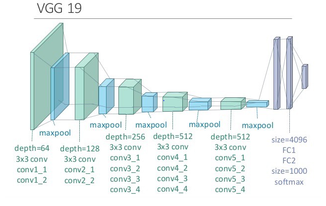

# Klasifikasi Penyakit Mata melalui Citra Retina menggunakan CNN (Convolutional Neural Network) dengan Model Arsitektur VGG-19 👁️

## 📖 Deskripsi Proyek
Proyek ini berfokus pada klasifikasi penyakit mata manusia melalui citra retina menggunakan Convolutional Neural Networks (CNN) dan dengan menggunakan arsitektur model VGG-19. Penyakit mata seperti *diabetic_retinopathy*, *glaucoma*, dan *cataract* merupakan risiko kesehatan yang serius, dan deteksi dini sangat penting untuk mencegah dampak buruk, termasuk kebutaan.

---
## 🎯 Tujuan
Tujuan proyek ini adalah memanfaatkan teknik pembelajaran mesin *(Machine Learning)* dan mendalam *(Deep Learning)* untuk mengembangkan sistem klasifikasi yang akurat dan efisien untuk penyakit mata, sehingga dapat menjadi alat bantu bagi tenaga medis dalam diagnosis dan perencanaan pengobatan.

---
## 🌕 Dataset
Dataset yang digunakan untuk pelatihan dan pengujian model diperoleh dari Kaggle. Dataset ini terdiri dari 4217 citra retina yang telah dikategorikan ke dalam beberapa jenis penyakit mata dengan pembagian sebanyak 1098 *diabetic_retinopathy*, 1007 *glaucoma*,  1038 *cataract* dan 1074 *normal* yang kemudian di pisah dengan ratio 80% data train, 10% data val, dan 10% data test, dan setelah itu melakukan proses augmentasi 1:4 terhadap data train. Anda dapat mengunduh dataset melalui tautan berikut: [Dataset Citra Retina dari Kaggle](https://www.kaggle.com/).

---
## 🚀 Instalasi
Ikuti langkah-langkah berikut untuk mengatur dan menjalankan aplikasi:

### Prasyarat
Pastikan Python sudah terinstal di sistem Anda. Disarankan menggunakan Python versi 3.11.4 atau lebih baru.

### Langkah Instalasi
1. Clone repositori:
   ```bash
   git clone <repository-link>
   cd <repository-folder>
   ```

2. Instal dependensi yang dibutuhkan:
   - Instal TensorFlow:
     ```bash
     pip install tensorflow
     ```
   - Instal dependensi lainnya menggunakan `pdm`:
     ```bash
     pdm add streamlit
     pdm add tensorflow
     ```

3. Masuk ke direktori aplikasi:
   ```bash
   cd src/code
   ```

4. Jalankan aplikasi menggunakan Streamlit:
   ```bash
   streamlit run app.py
   ```

---
## 🧠 Deskripsi Model
---
### CNN Model
Model Convolutional Neural Network (CNN) memiliki 3 hidden layers, 1 fully-connected layer, dan 2 fully-connected layers memiliki struktur kompleks. Data input, seperti gambar, diproses melalui tiga hidden layers yang terdiri dari convolutional layers untuk mengekstrak fitur lokal (seperti tepi dan tekstur) dan pooling layers untuk mengurangi dimensi data. Hasilnya diteruskan ke fully-connected layer pertama yang meratakan data, diikuti oleh fully-connected layer kedua untuk menghasilkan representasi fitur lebih kompleks, yang akhirnya menghasilkan prediksi. Struktur ini memungkinkan model menangkap pola yang lebih mendalam, meskipun memerlukan komputasi lebih tinggi dan risiko overfitting jika dataset terbatas.


---
### Arsitektur Model VGG-19
VGG19 adalah salah satu arsitektur dari **Convolutional Neural Network (CNN)** yang terkenal karena kedalamannya yang mencapai 19 lapisan. Arsitektur ini terdiri dari 16 **Convolutional layers**, yang berperan penting dalam mengekstraksi fitur-fitur utama dari citra, seperti tepi, tekstur, dan pola bentuk yang lebih kompleks. Setiap lapisan konvolusi bekerja secara hierarkis, mulai dari fitur dasar di lapisan awal hingga fitur yang lebih kompleks di lapisan-lapisan berikutnya. Selain itu, VGG19 dilengkapi dengan 5 **Max pooling layers**, yang berfungsi untuk mereduksi dimensi data yang diproses, mengurangi kompleksitas komputasi, serta meningkatkan kemampuan model dalam melakukan generalisasi terhadap data baru. Proses ini juga membantu dalam mengurangi risiko overfitting, memungkinkan model untuk lebih adaptif terhadap variabilitas dalam data. Pada bagian akhir, model ini memiliki 3 **fully connected layers**, yang menghubungkan neuron-neuron dari lapisan-lapisan sebelumnya untuk menghasilkan keputusan klasifikasi yang akurat. Fully connected layers bertugas untuk menggabungkan informasi yang telah diproses di lapisan konvolusi dan pooling, sehingga menghasilkan prediksi akhir berdasarkan informasi yang terkandung dalam fitur citra. Karena kemampuannya dalam menangkap informasi secara mendalam dan hierarkis, VGG19 telah banyak diterapkan dalam berbagai aplikasi pengenalan citra, termasuk pengenalan wajah, klasifikasi objek, dan analisis citra medis, menjadikannya pilihan populer dalam tugas-tugas yang melibatkan data citra kompleks.


### Analisis Performa
Kinerja model dievaluasi menggunakan dataset citra retina yang telah diberi label. Metode evaluasi meliputi:
- **Akurasi**: Mencapai akurasi lebih dari 90% pada dataset pengujian.
- **Presisi, Recall, dan F1-Score**: Menunjukkan performa yang andal pada semua kelas.

---

## 📊 Hasil dan Analisis
Hasil klasifikasi dirangkum dalam tabel berikut:

*CNN*
| **Class**   | **Precision** | **Recall** | **F1-Score** | **Support** |
|-------------|---------------|------------|--------------|-------------|
| **Cataract**| 0.91          | 0.70       | 0.79         |105          |
| **Diabetic**| 0.89          | 0.84       | 0.86         |111          |
| **Glaucoma**| 0.69          | 0.63       | 0.66         |102          |
| **Normal**  | 0.61          | 0.84       | 0.71         |108          |
|------------|--------------|-----------|-------------|------------|
| **Accuracy**|               |            | 0.75         |426          |
| **MacroAVG**| 0.78          | 0.75       | 0.75         |426          |
| **MicroAVG**| 0.78          | 0.75       | 0.76         |426          |

*VGG19*
| **Class**   | **Precision** | **Recall** | **F1-Score** | **Support** |
|-------------|---------------|------------|--------------|-------------|
| **Cataract**| 0.88          | 0.85       | 0.86         |105          |
| **Diabetic**| 0.90          | 0.79       | 0.84         |111          |
| **Glaucoma**| 0.91          | 0.52       | 0.66         |102          |
| **Normal**  | 0.59          | 0.92       | 0.71         |108          |
|------------|--------------|-----------|-------------|------------|
| **Accuarcy**|               |            | 0.77         |426          |
| **MacroAVG**| 0.82          | 0.77       | 0.77         |426          |
| **MicroAVG**| 0.82          | 0.77       | 0.77         |426          |


### Perbandingan Performa
Model VGG-19 menunjukkan performa yang lebih baik dibandingkan model CNN baseline dalam semua metrik utama, sehingga cocok untuk aplikasi ini.

### Visualisasi
Berikut adalah beberapa visualisasi:
- **Akurasi Pelatihan dan Validasi**
- **Matriks Kebingungan**
- **Kurva ROC**

---

## 🌐 Demo Langsung
Coba aplikasi langsung di sini: [Tautan Demo Langsung](#)

---
## 🤝 Kontribusi
Silakan fork repositori ini, ajukan isu, atau kirimkan pull request untuk berkontribusi pada proyek ini.
